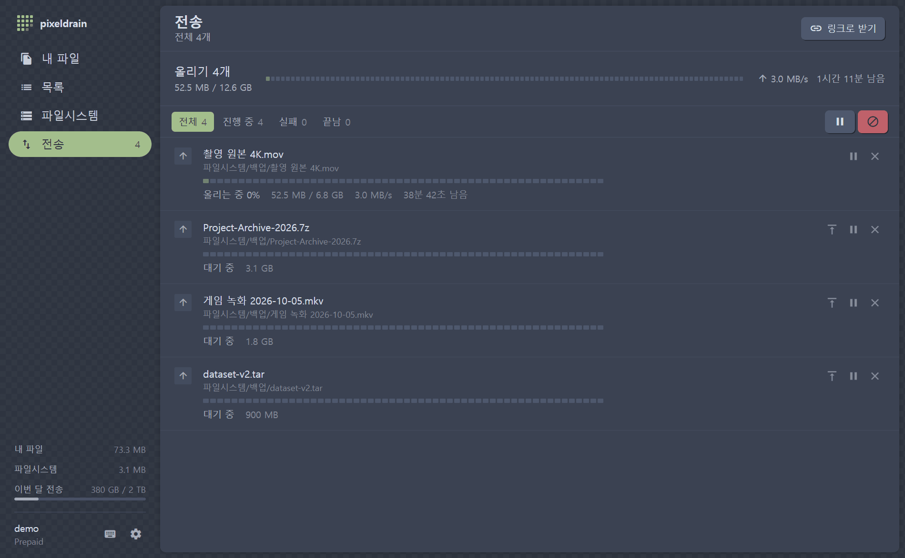
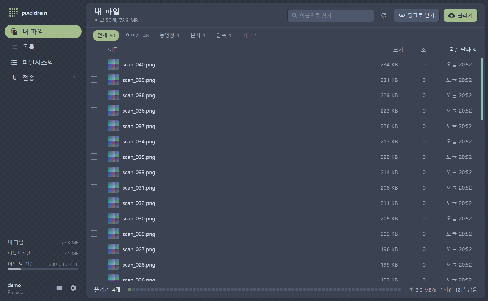
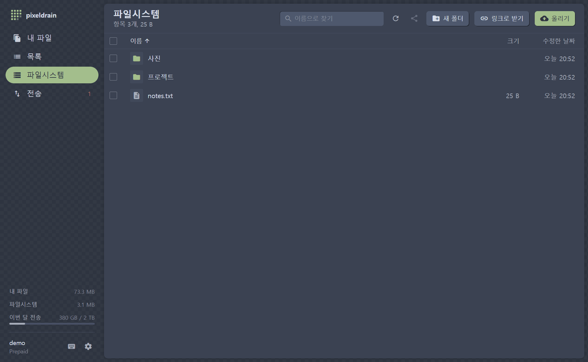
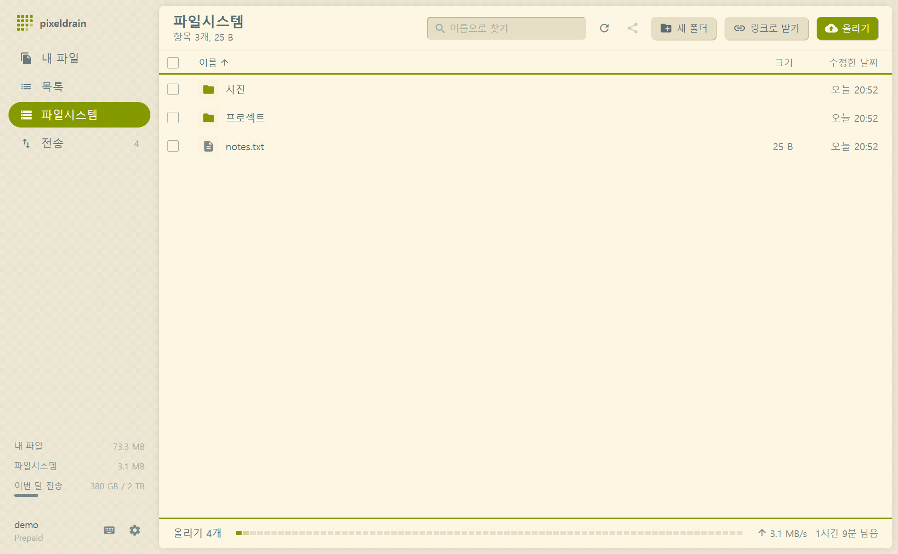

<div align="center">


# Pixeldrain Desktop

**[pixeldrain.com](https://pixeldrain.com)을 위한 Windows 네이티브 파일 관리자와 대용량 업로더**

수십 GB 파일도 디스크에서 바로 스트리밍하고, 끊기면 알아서 다시 보내고, 끝나면 SHA-256으로 확인합니다.

[](https://github.com/sioaeko/pixeldrain-desktop/releases/latest)


[](LICENSE)



</div>

> [!NOTE]
> pixeldrain.com과 제휴하지 않은 개인 프로젝트입니다. API 동작과 서비스 정책은 [공식 API 문서](https://pixeldrain.com/api)를 따릅니다.

## 한눈에 보기

|  |  |
|---|---|
| 📁 **파일 관리자** | 내 파일, 목록, 파일시스템(유료 요금제)을 탐색기처럼. 썸네일, 정렬, 검색, 다중 선택, 오른쪽 클릭 메뉴, 단축키 |
| 🚀 **대용량 업로드** | 메모리를 거의 쓰지 않는 스트리밍, 자동 재시도, 멈춤 감지, SHA-256 검증, 재시작 후 이어서 |
| ⬇️ **이어받기 다운로드** | `.pdpart` Range 이어받기, 해시 검증, 폴더 구조 유지, 여유 공간 확인 |
| 🔗 **링크로 받기** | `/u/`, `/l/`, `/d/` 링크와 파일 ID를 여러 줄로 붙여 넣기, 클립보드 감지 |
| 🪟 **Windows 통합** | 탐색기에서 끌어 놓기·Ctrl+V, "보내기 > Pixeldrain", 작업 표시줄 진행률, 완료 알림, 절전 방지 |
| 🔐 **안전한 키 보관** | API 키는 Windows DPAPI로 암호화해 저장하고 pixeldrain 호스트에만 보냅니다 |

## 다운로드

[**Releases**](https://github.com/sioaeko/pixeldrain-desktop/releases/latest)에서 `Pixeldrain.exe`를 받아 실행하면 됩니다. 설치가 필요 없는 단일 실행 파일입니다.

- Windows 10/11 x64, [WebView2 런타임](https://developer.microsoft.com/microsoft-edge/webview2/) 필요(Windows 11에는 기본 포함)
- 서명되지 않은 개인 빌드라 SmartScreen 경고가 뜰 수 있습니다. **추가 정보 → 실행**을 누르세요.
- 로그인은 [API 키](https://pixeldrain.com/user/api_keys)를 붙여 넣거나 아이디/비밀번호(2단계 인증 포함)로 합니다. 로그인 없이 링크 다운로드만 쓸 수도 있습니다.

## 스크린샷

<table>
  <tr>
    <td width="50%"><p align="center"><sub>내 파일: 종류별 필터와 아래쪽 전송 막대</sub></p></td>
    <td width="50%"><p align="center"><sub>파일시스템: 폴더 탐색, 새 폴더, 공유 링크</sub></p></td>
  </tr>
  <tr>
    <td width="50%"><p align="center"><sub>전송: 남은 시간, 일시정지, 맨 앞으로, 취소</sub></p></td>
    <td width="50%"><p align="center"><sub>Nord / Solarized 테마, 밝게·어둡게·시스템</sub></p></td>
  </tr>
</table>

## 대용량 업로드는 이렇게 동작합니다

pixeldrain API에는 나눠 올리기(청크 업로드)가 없어서, 파일 하나는 한 번의 요청으로 끝까지 보내야 합니다. 그래서 **끊기지 않게, 끊겨도 확실하게 복구되게** 만드는 데 집중했습니다.

```text
로컬 파일 ──스트리밍(+SHA-256 계산)──▶ PUT ──▶ pixeldrain
   │                                         │
   │    끊김 · 5xx · 429 · 2분간 멈춤          ▼
   └──── 2s → 4s → 8s … 재시도 ◀──── 서버 해시와 비교, 다르면 지우고 다시
```

- **스트리밍**: 디스크에서 바로 보냅니다. 12 GB를 올려도 메모리는 5 MB 남짓입니다.
- **검증**: 보내는 동안 SHA-256을 계산하고, 끝나면 pixeldrain이 알려 준 해시와 비교합니다. 다르면 잘못 올라간 사본을 지우고 다시 올립니다.
- **재시도**: 연결 끊김, 5xx, 429는 2초·4초·8초… 간격으로 다시 시도합니다(기본 5번). 2분 동안 바이트가 움직이지 않으면 연결을 끊고 다시 시도합니다.
- **오프라인 대기**: 인터넷이 끊기면 재시도 횟수를 쓰지 않고 연결이 돌아올 때까지 기다립니다(최대 24시간).
- **중복 건너뛰기**: 이미 있는 파일은 이름과 크기, 또는 설정에 따라 SHA-256 내용으로 비교해 건너뜁니다.
- **재시작 복원**: 전송 목록은 디스크에 저장됩니다. 앱을 다시 열면 남은 전송을 이어 갑니다. 다운로드는 `.pdpart`에서 이어받고, 업로드는 처음부터 다시 올립니다.
- **미리 막기**: 요금제의 파일 크기 한도(무료 10 GB)를 넘는 파일은 보내기 전에 알려 줍니다. 큰 업로드를 일시정지·취소하면 다시 올려야 하는 양을 알려 주고 확인을 받습니다.
- **그 밖에**: 업로드 속도 제한, 전송 중 절전 방지. 폴더를 "내 파일"에 올리면 폴더 이름의 목록을 자동으로 만들어 링크 하나로 공유합니다.

다운로드도 Range 이어받기, 재시도, SHA-256 검증을 거친 뒤에만 최종 파일 이름으로 바꿉니다. CAPTCHA, 다운로드 한도, 법적 차단은 **우회하지 않고** 이유를 그대로 보여 줍니다.

### 측정 결과

수 GB 파일로 확인하는 통합 테스트 결과입니다(Ryzen 7 7800X3D, 같은 PC의 TLS 가짜 서버라 네트워크 속도는 빠진 값).

| 경우 | 4 GB | 12 GB |
|---|---|---|
| 업로드 | 646 MB/s, 최대 메모리 5.3 MB | 540 MB/s, 최대 메모리 4.9 MB |
| 70%에서 연결 끊김 | ✅ 자동 재시도 후 SHA-256 일치 | ✅ 자동 재시도 후 SHA-256 일치 |
| 30%에서 서버 멈춤 | ✅ 감지 후 재시도, 성공 | |
| 서버가 12초 동안 마무리 | ✅ 끊지 않고 기다려 한 번에 성공 | |
| 업로드 2개 동시(4 GB + 2 GB) | 합계 943 MB/s, 최대 메모리 5.7 MB | |
| 50%에서 다운로드 끊김 | ✅ Range로 이어받아 SHA-256 일치 | ✅ Range로 이어받아 SHA-256 일치 |
| 무료 요금제 10 GB 초과 | ✅ 한 바이트도 보내기 전에 거부 | |

## 기능 자세히

<details>
<summary><b>파일 관리</b></summary>

- **내 파일**: 썸네일, 정렬, 검색, 여러 개 선택(Shift/Ctrl, Ctrl+A), 미리 보기(이미지, 동영상, 오디오, PDF, 텍스트), 링크 복사, 목록 만들기, 삭제
- **목록**: 내 목록 보기, 목록 링크 복사, 목록째 받기(목록 이름 폴더에 저장)
- **파일시스템**(유료 요금제): 폴더 탐색, 새 폴더, 이름 바꾸기, 삭제, 공유 링크, 폴더 구조를 유지한 업로드와 다운로드
- 파일 종류별 필터, 선택한 파일의 합계 크기, 정렬 기억
- 미리 보기에서 ←/→로 이전·다음 파일, 외부 플레이어(mpv, VLC, PotPlayer)로 재생

</details>

<details>
<summary><b>올리기와 받기</b></summary>

- 탐색기에서 끌어 놓기, 탐색기에서 복사 후 Ctrl+V, 파일/폴더 선택, 탐색기의 "보내기 > Pixeldrain"(설정에서 켜기)
- 올리기가 끝나면 링크를 자동으로 복사합니다(폴더는 목록 링크 하나). 형식은 공유 페이지, 직접 다운로드, 마크다운 중에서 고릅니다.
- `/u/`, `/l/`, `/d/` 링크와 파일 ID를 여러 줄로 붙여 넣어 받기. 다른 곳에서 pixeldrain 링크를 복사하고 돌아오면 받을지 물어봅니다.
- 두 번째로 실행할 때 넘긴 링크나 파일은 이미 열린 창으로 전달됩니다.
- 대기 중인 전송을 맨 앞으로 옮기기, 실패한 전송 한 번에 다시 시도

</details>

<details>
<summary><b>Windows 통합</b></summary>

- 작업 표시줄 아이콘과 창 제목에 전체 진행률
- 창이 뒤에 있을 때 전송이 끝나면 Windows 알림
- 전송 중 절전 모드 방지
- 다운로드 전 저장 드라이브의 여유 공간 확인
- 창 크기와 위치 기억, 단일 실행

</details>

<details>
<summary><b>단축키</b></summary>

앱에서 `?`를 누르면 전체 목록이 나옵니다.

</details>

## 데이터 저장 위치

| 경로 | 내용 |
|---|---|
| `%APPDATA%\PixeldrainDesktop\config.json` | 설정, 창 크기와 위치, API 키(Windows DPAPI로 암호화) |
| `%LOCALAPPDATA%\PixeldrainDesktop\queue.json` | 전송 목록 |
| `%LOCALAPPDATA%\PixeldrainDesktop\hashes.json` | 로컬 파일의 SHA-256 캐시 |

## 직접 빌드하기

요구 사항: Go 1.26 이상, Node 20 이상, [Wails CLI](https://wails.io/docs/gettingstarted/installation)

```bash
go install github.com/wailsapp/wails/v2/cmd/wails@latest
```

```bash
wails build
```

결과물은 `build/bin/Pixeldrain.exe`에 생깁니다.

```bash
go test ./...
```

가짜 pixeldrain 서버로 업로드, 다운로드, 재시도, 검증을 확인하는 통합 테스트입니다.

### 실제 계정 없이 개발하기

가짜 API 서버를 띄우고 `dev-mock.cmd`로 실행합니다.

```bash
go run ./cmd/mockserver -addr 127.0.0.1:8091 -throttle 2048
```

```bash
dev-mock.cmd
```

API 키 `test-key` 또는 아이디/비밀번호 `demo`/`demo`로 로그인합니다. `-throttle`(KiB/s)로 전송 속도를 늦추면 진행 화면을 확인하기 쉽습니다. `dev-mock.cmd`는 `PIXELDRAIN_DESKTOP_HOME`을 `.devhome`으로 바꿉니다. 설정, 전송 목록, 기본 저장 폴더가 모두 `.devhome` 안에 생기고, 설치된 앱과 따로 실행됩니다.

### 대용량 전송 테스트

수 GB 파일 테스트는 따로 켭니다. 가짜 서버가 TLS로 받으면서 해시만 계산하므로(파일을 메모리에 쌓지 않음) 실제 서버처럼 동작합니다.

```bash
PD_LARGE=1 PD_LARGE_GB=12 PD_LARGE_DIR='D:\pdtest' go test -run TestLargeTransfers -v -timeout 2h .
```

## 구조

| 경로 | 역할 |
|---|---|
| `api.go` | pixeldrain REST 클라이언트 (API 키는 pixeldrain 호스트에만 전송) |
| `transfers.go` | 전송 큐, 동시성, 일시정지, 재시도, 저장과 복원, 목록 자동 생성 |
| `upload.go` / `download.go` | 업로드 스트리밍과 해시 검증 / Range 이어받기와 해시 검증 |
| `hashes.go` | SHA-256 캐시, 계정 파일 색인(중복 검사) |
| `links.go` | `/u/`, `/l/`, `/d/` 링크 해석과 공유 폴더 재귀 탐색 |
| `media.go` | 썸네일과 미리 보기용 루프백 프록시 (API 키를 페이지에 노출하지 않음) |
| `app.go` | 프런트엔드에 노출하는 메서드 |
| `internal/mockpd`, `cmd/mockserver` | 테스트와 개발용 가짜 pixeldrain API |
| `frontend/src/components` | 화면 (`files-view`, `lists-view`, `fs-view`, `transfers-view`, `pixel-strip` …) |

Go + [Wails v2](https://wails.io)(WebView2), React 18 + Tailwind CSS 3.4로 만들었습니다.

## 라이선스와 고지

[MIT](LICENSE)

pixeldrain 웹사이트 소스([pixeldrain_web](https://github.com/Fornaxian/pixeldrain_web))는 AGPL-3.0입니다. 이 앱은 그 코드, 이미지, 로고를 복사하지 않았고 화면을 보고 다시 구현했습니다. 같은 분위기를 내는 재료는 모두 별도 라이선스입니다.

- 색상: [Nord](https://www.nordtheme.com/)(MIT), [Solarized](https://ethanschoonover.com/solarized/) 팔레트
- 아이콘: [Material Icons](https://github.com/google/material-design-icons)(Apache-2.0)
- 앱 아이콘: 직접 만든 픽셀 마크

이 프로그램은 pixeldrain의 공식 제한을 그대로 따릅니다. 본인이 소유했거나 받을 권한이 있는 파일에만 사용하세요.
