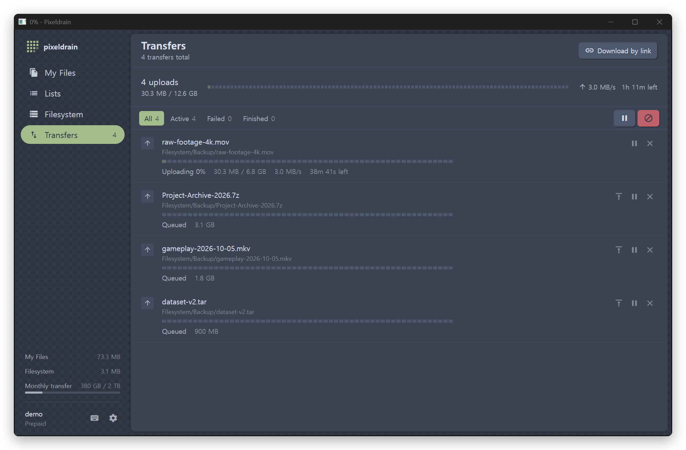
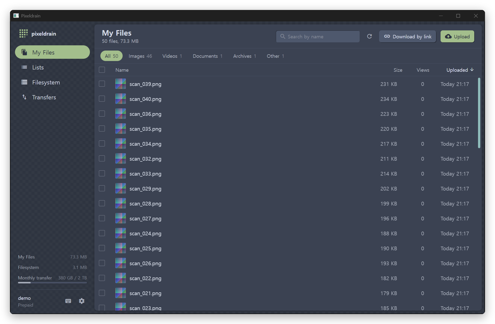
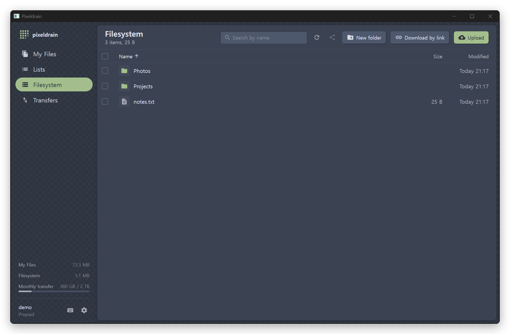
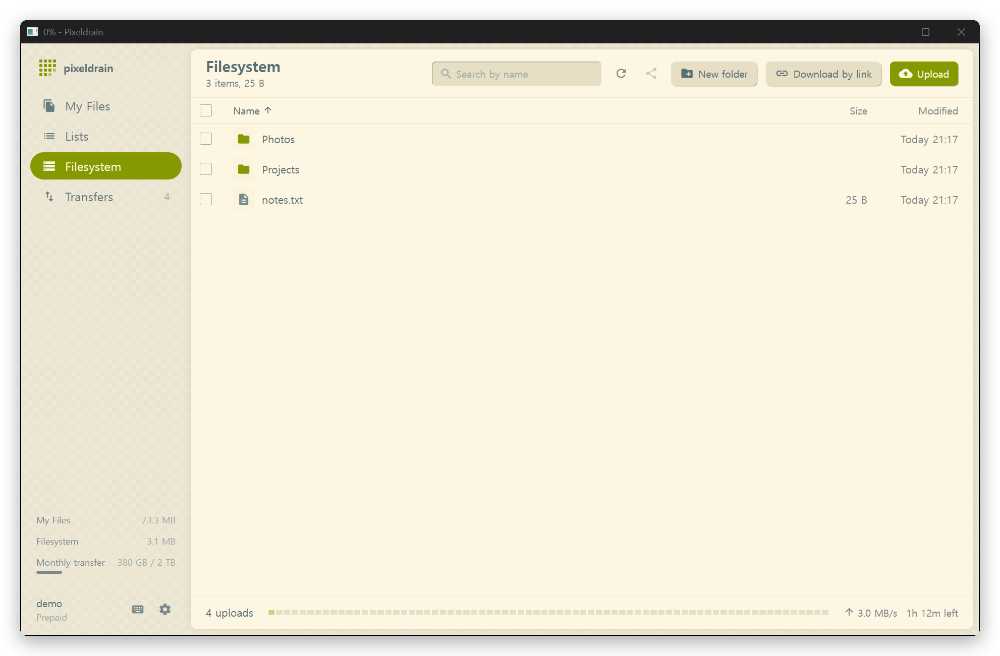

<div align="center">


# Pixeldrain Desktop

**English** · [한국어](README.ko.md)

**A native Windows file manager and large-file uploader for [pixeldrain.com](https://pixeldrain.com)**

Streams files of tens of gigabytes straight from disk, resends them on its own when the connection drops, and checks every upload with SHA-256.

[](https://github.com/sioaeko/pixeldrain-desktop/releases/latest)


[](LICENSE)
[](https://github.com/sioaeko/pixeldrain-desktop/actions/workflows/ci.yml)



</div>

> [!NOTE]
> This is an unofficial personal project, not affiliated with pixeldrain.com. API behavior and service policy follow the [official API documentation](https://pixeldrain.com/api).

## At a glance

|  |  |
|---|---|
| 📁 **File manager** | Browse My Files, Lists and the Filesystem (paid plans) like Explorer: thumbnails, sorting, search, multi-select, context menus, keyboard shortcuts |
| 🚀 **Large uploads** | Near-zero memory streaming, automatic retries, stall detection, SHA-256 verification, picks up again after a restart |
| ⬇️ **Resumable downloads** | `.pdpart` Range resume, hash verification, folder structure kept, free-space check |
| 🔗 **Download by link** | Paste `/u/`, `/l/`, `/d/` links or file IDs, several per line; clipboard detection |
| 🪟 **Windows integration** | Drag from Explorer, Ctrl+V, "Send to > Pixeldrain", taskbar progress, completion notifications, sleep prevention |
| 🔐 **Safe key storage** | The API key is encrypted with Windows DPAPI and only ever sent to pixeldrain hosts |
| 🌐 **English / Korean** | Follows the Windows display language; switch any time in Settings |

## Download

Get `Pixeldrain.exe` from [**Releases**](https://github.com/sioaeko/pixeldrain-desktop/releases/latest) and run it. It is a single executable, no installer needed.

- Windows 10/11 x64 with the [WebView2 runtime](https://developer.microsoft.com/microsoft-edge/webview2/) (built into Windows 11)
- The build is unsigned, so SmartScreen may warn you. Click **More info → Run anyway**.
- Sign in by pasting an [API key](https://pixeldrain.com/user/api_keys), or with your username and password (two-factor authentication supported). You can also skip sign-in and only download links.
- On start the app asks GitHub whether a newer release exists and shows it in the sidebar. Nothing about your account is sent; turn it off in Settings.

## Screenshots

<table>
  <tr>
    <td width="50%"><p align="center"><sub>My Files: type filters and the bottom transfer bar</sub></p></td>
    <td width="50%"><p align="center"><sub>Filesystem: folders, new folder, share links</sub></p></td>
  </tr>
  <tr>
    <td width="50%"><p align="center"><sub>Transfers: time left, pause, move to front, cancel</sub></p></td>
    <td width="50%"><p align="center"><sub>Nord / Solarized themes, light, dark or system</sub></p></td>
  </tr>
</table>

## How large uploads work

The pixeldrain API has no chunked upload, so each file has to go up in a single request from start to finish. The app therefore focuses on **not dropping the connection, and recovering reliably when it does**.

```text
local file ──stream (+ SHA-256)──▶ PUT ──▶ pixeldrain
    │                                        │
    │   drop · 5xx · 429 · stalled for 2 min ▼
    └──── retry after 2s → 4s → 8s … ◀──── compare with the server's hash; on mismatch delete and resend
```

- **Streaming**: files are sent straight from disk. A 12 GB upload uses only about 5 MB of memory.
- **Verification**: SHA-256 is computed while sending and compared with the hash pixeldrain reports. On a mismatch the bad copy is deleted and the file is uploaded again.
- **Retries**: dropped connections, 5xx and 429 responses are retried after 2, 4, 8… seconds (5 times by default). If no bytes move for 2 minutes, the connection is closed and retried.
- **Offline wait**: when the internet goes down, the app waits for it to come back (up to 24 hours) without using up retries.
- **Duplicate skipping**: files that already exist are skipped, compared by name and size or, if you choose, by SHA-256 content.
- **Restart recovery**: the transfer list is saved to disk. Reopen the app and the remaining transfers continue. Downloads resume from `.pdpart`; uploads start over from the beginning.
- **Early checks**: files over your plan's size limit (10 GB on the free plan) are rejected before anything is sent. Pausing or cancelling a big upload tells you how much will have to be resent and asks first.
- **Also**: upload speed limit and sleep prevention during transfers. Uploading a folder to My Files automatically creates a list named after the folder, so it can be shared with one link.

Downloads also go through Range resume, retries and SHA-256 verification before getting their final file name. CAPTCHAs, download limits and legal blocks are **not bypassed**; the app shows the reason as-is.

### Measurements

Integration tests with multi-gigabyte files (Ryzen 7 7800X3D against a local TLS mock server, so network speed is not a factor).

| Case | 4 GB | 12 GB |
|---|---|---|
| Upload | 646 MB/s, peak memory 5.3 MB | 540 MB/s, peak memory 4.9 MB |
| Connection dropped at 70% | ✅ retried automatically, SHA-256 matches | ✅ retried automatically, SHA-256 matches |
| Server stalls at 30% | ✅ detected, retried, succeeded | |
| Server takes 12 s to finalize | ✅ waited without cutting off, succeeded first try | |
| Two uploads at once (4 GB + 2 GB) | 943 MB/s combined, peak memory 5.7 MB | |
| Download dropped at 50% | ✅ resumed with Range, SHA-256 matches | ✅ resumed with Range, SHA-256 matches |
| Over the free plan's 10 GB limit | ✅ rejected before sending a single byte | |

## Features in detail

<details>
<summary><b>File management</b></summary>

- **My Files**: thumbnails, sorting, search, multi-select (Shift/Ctrl, Ctrl+A), preview (image, video, audio, PDF, text), copy link, create list, delete
- **Lists**: view your lists, copy list links, download a whole list (saved into a folder named after it)
- **Filesystem** (paid plans): browse folders, new folder, rename, delete, share links, upload and download with folder structure kept
- Filter by file type, total size of the selection, remembered sort order
- ←/→ to step through files in the preview, play in an external player (mpv, VLC, PotPlayer)

</details>

<details>
<summary><b>Uploading and downloading</b></summary>

- Drag from Explorer, copy in Explorer then Ctrl+V, file/folder picker, Explorer's "Send to > Pixeldrain" (enable in settings)
- Links are copied automatically when uploads finish (one list link for a folder). Choose between share page, direct download and Markdown format.
- Paste `/u/`, `/l/`, `/d/` links or file IDs, several per line. Copy a pixeldrain link elsewhere and the app offers to download it when you come back.
- Links or files passed to a second launch are forwarded to the window that is already open.
- Move queued transfers to the front, retry all failed transfers at once

</details>

<details>
<summary><b>Windows integration</b></summary>

- Overall progress on the taskbar icon and in the window title
- A Windows notification when transfers finish while the window is in the background
- Prevents sleep during transfers
- Checks free space on the target drive before downloading
- Remembers window size and position; single instance

</details>

<details>
<summary><b>Keyboard shortcuts</b></summary>

Press `?` in the app for the full list.

</details>

## Where data is stored

| Path | Contents |
|---|---|
| `%APPDATA%\PixeldrainDesktop\config.json` | Settings, window size and position, API key (encrypted with Windows DPAPI) |
| `%LOCALAPPDATA%\PixeldrainDesktop\queue.json` | Transfer list |
| `%LOCALAPPDATA%\PixeldrainDesktop\hashes.json` | SHA-256 cache of local files |

## Building from source

Requirements: Go 1.26+, Node 20+, the [Wails CLI](https://wails.io/docs/gettingstarted/installation)

```bash
go install github.com/wailsapp/wails/v2/cmd/wails@latest
```

```bash
wails build
```

The result is written to `build/bin/Pixeldrain.exe`.

```bash
go test ./...
```

Integration tests for upload, download, retry and verification against a mock pixeldrain server.

### Developing without a real account

Start the mock API server, then run `dev-mock.cmd`.

```bash
go run ./cmd/mockserver -addr 127.0.0.1:8091 -throttle 2048
```

```bash
dev-mock.cmd
```

Sign in with API key `test-key` or username/password `demo`/`demo`. `-throttle` (KiB/s) slows transfers down so the progress UI is easy to check, and `-lang en` seeds English sample file names. `dev-mock.cmd` points `PIXELDRAIN_DESKTOP_HOME` at `.devhome`, so settings, the transfer list and the default download folder all live there, and it runs alongside an installed copy of the app.

### Large transfer tests

Multi-gigabyte tests are opt-in. The mock server receives over TLS and only hashes the data (nothing is buffered in memory), so it behaves like the real server.

```bash
PD_LARGE=1 PD_LARGE_GB=12 PD_LARGE_DIR='D:\pdtest' go test -run TestLargeTransfers -v -timeout 2h .
```

### Releasing

Bump `appVersion` in `app.go` and `productVersion` in `wails.json`, commit, then push a matching tag:

```bash
git tag v1.2.0
```

```bash
git push origin v1.2.0
```

[`release.yml`](.github/workflows/release.yml) checks that the versions match the tag, runs the tests, builds `Pixeldrain.exe` and publishes it as a GitHub release. Every push to `main` also runs [`ci.yml`](.github/workflows/ci.yml) and keeps the built exe as an artifact for 14 days.

## Project layout

| Path | Role |
|---|---|
| `api.go` | pixeldrain REST client (the API key is only sent to pixeldrain hosts) |
| `transfers.go` | Transfer queue, concurrency, pause, retries, save and restore, automatic lists |
| `upload.go` / `download.go` | Upload streaming with hash verification / Range resume with hash verification |
| `hashes.go` | SHA-256 cache, account file index (duplicate checks) |
| `links.go` | Parsing `/u/`, `/l/`, `/d/` links and walking shared folders recursively |
| `media.go` | Loopback proxy for thumbnails and previews (keeps the API key out of the page) |
| `app.go` | Methods exposed to the frontend |
| `update.go` | Checks GitHub for a newer release |
| `i18n.go`, `frontend/src/lib/i18n.ts` | Korean and English strings |
| `internal/mockpd`, `cmd/mockserver` | Mock pixeldrain API for tests and development |
| `frontend/src/components` | UI (`files-view`, `lists-view`, `fs-view`, `transfers-view`, `pixel-strip` …) |

Built with Go + [Wails v2](https://wails.io) (WebView2), React 18 and Tailwind CSS 3.4.

## License and notices

[MIT](LICENSE)

The pixeldrain website source ([pixeldrain_web](https://github.com/Fornaxian/pixeldrain_web)) is AGPL-3.0. This app copies none of its code, images or logos; the look was reimplemented by eye. Everything used to match the style is separately licensed:

- Colors: [Nord](https://www.nordtheme.com/) (MIT) and [Solarized](https://ethanschoonover.com/solarized/) palettes
- Icons: [Material Icons](https://github.com/google/material-design-icons) (Apache-2.0)
- App icon: an original pixel mark

This program respects pixeldrain's official limits. Only use it for files you own or have the right to download.
